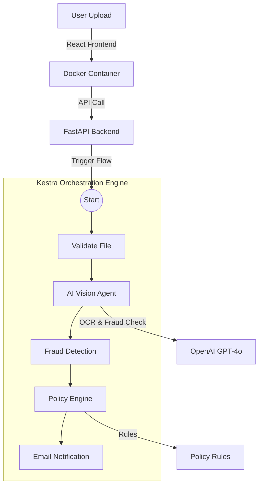

# ClaimGuard AI - Forensic Adjudication Engine

[](https://assemblehack.com)
[](https://kestra.io)
[](https://openai.com)
[](https://docker.com)
[](https://vercel.com)
[](LICENSE)

> **Automated AI-powered claim adjudication system for Indian Health Insurance.**
>
> 🚀 **Processing claims in seconds, not days.**

## 🎯 Project Overview

**ClaimGuard AI** is a fully automated Forensic Adjudication Engine that combines **GenAI Vision** with strict **Policy Rule Enforcement**. It solves the problem of manual, error-prone insurance claim processing by automating the entire workflow from receipt upload to final approval.

### Only 3 Steps:
1.  **AI Vision**: Extracts structured data from receipt images (Medicine names, amounts, dates) using **OpenAI GPT-4o**.
2.  **Policy Engine**: Validates every single item against **Indian Insurance Policy** rules (Exclusions, Room Rent Capping, Proportionate Deductions).
3.  **Kestra Workflow**: Orchestrates the entire pipeline, handling file passing, logic flow, and notifications.

---

## 🏗️ Architecture



---

## 🚀 Features

### ✅ 1. AI-Powered Fraud Detection
-   Detects **photoshopped** receipts (pixel inconsistencies)
-   Identifies **duplicate** or tampered bills
-   Flags **missing mandatory fields** (GST, Doctor Reg No.)

### ✅ 2. Complex Policy Math
-   **Room Rent Capping**: Automatically calculates proportionate deductions if room rent > 1% of Sum Insured.
    -   *Example: If room rent is ₹8,000 (limit ₹5,000), system deducts 37.5% from ENTIRE claim.*
-   **Exclusion Logic**: Automatically rejects 85+ non-payable items (Supplements, Cosmetics, Diapers, etc.).

### ✅ 3. Full Orchestration
-   **Kestra** manages the 6-stage pipeline.
-   **Dockerized** for instant deployment.
-   **Vercel-ready** frontend.

---

## 🛠️ Technology Stack

| Component | Technology | Role |
|-----------|------------|------|
| **Orchestration** | **Kestra** | Workflow management, state handling, retries |
| **AI Vision** | **OpenAI GPT-4o** | OCR, Data Extraction, Visual Fraud Check |
| **Backend** | **Python (FastAPI)** | API, Policy Logic, Math Engine |
| **Frontend** | **React + Vite** | User Interface (Deployed on Vercel) |
| **Infrastructure** | **Docker** | Containerization & Networking |

---

## 📂 Project Structure

```
ClaimGuardAI/
├── backend/                 # FastAPI Application
│   ├── vision_agent.py      # OpenAI Integration
│   ├── policy_engine.py     # Rule Engine Logic
│   └── main.py              # API Endpoints
│
├── frontend/                # React Application
│   ├── src/                 # Components & Pages
│   └── vercel.json          # Deployment Config
│
├── kestra/                  # Orchestration
│   └── insurance_flow.yaml  # 6-Stage Workflow Definition
│
├── docker/                  # Infrastructure
│   └── docker-compose.yml   # Full Stack Setup
│
└── data/                    # Rules & Rulesets
    ├── policy_rules.json    # Configurable Insurance Rules
    └── claim_valid.json     # Test Data
```

---

## ⚡ Quick Start (Docker)

The easiest way to run ClaimGuard AI is using Docker.

### 1. Prerequisites
-   Docker Desktop installed
-   OpenAI API Key

### 2. Setup

Create a `.env` file in the `docker/` directory:

```env
OPENAI_API_KEY=sk-your-openai-key-here
```

### 3. Run

```bash
cd docker
docker compose up
```

Access the application:
-   **Frontend**: `http://localhost:5173`
-   **Kestra UI**: `http://localhost:8080`
-   **Backend API**: `http://localhost:8000/docs`

---

## 🧪 Testing Scenarios

We have included test data to demonstrate specific capabilities:

### Scenario 1: **Clean Claim**
-   Upload `data/claim_valid.json` (mock receipt)
-   **Result**: ✅ **APPROVED** (All items payable)

### Scenario 2: **Exclusion Fraud**
-   Upload a receipt with "Whey Protein" and "Moisturizer"
-   **Result**: ⚠️ **PARTIALLY APPROVED** (Medicines paid, supplements rejected automatically)

### Scenario 3: **Room Rent Deviation**
-   Upload a receipt with high room rent
-   **Result**: ✂️ **PROPORTIONATE DEDUCTION** (Claim reduced by calculated ratio)

---

## 👨‍💻 Developer Guide

### Running without Docker

**Backend:**
```bash
cd backend
pip install -r requirements.txt
python main.py
```

**Frontend:**
```bash
cd frontend
npm install
npm run dev
```

**Kestra:**
(Requires Java 21+ or use Docker)

---

## 🏆 Hackathon Notes
**Assemble Hack 2025 Submission**

-   **CodeRabbit**: Integrated for code review.
-   **Vercel**: Frontend configuration ready.
-   **Kestra**: Core orchestration engine.

---

## 📝 License
MIT License
