# ClaimGuard AI 🏥

> **AI-Powered Insurance Claim Adjudication System**  
> Process medical claims in seconds with automated fraud detection and policy validation.

[](https://assemblehack.com)
[](https://kestra.io)
[](https://openai.com)
[](https://docker.com)
[](https://vercel.com)

**🌐 Live Demo**: [Visit ClaimGuard AI](claimguard-q2y5iipuq-sankar1manis-projects.vercel.app)
---

## 🎯 What is ClaimGuard AI?

ClaimGuard AI automates the entire insurance claim adjudication process for Indian health insurance. Upload a medical receipt, and our AI system:

1. **Extracts data** from the receipt using AI vision
2. **Detects fraud** (tampered receipts, excluded items)
3. **Applies policy rules** (room rent capping, exclusions)
4. **Generates decision** (approved/rejected with reasoning)

**Result**: Claims processed in seconds instead of days, with 100% policy compliance.

---

## ✨ Key Features

### 🔍 AI Vision & Fraud Detection
- Extracts structured data from receipt images (medicines, amounts, dates)
- Detects photoshopped or tampered receipts
- Identifies duplicate bills
- Validates mandatory fields (GST, Doctor Registration)

### 📋 Intelligent Policy Engine
- **Room Rent Capping**: Automatically calculates proportionate deductions
  - Example: If room rent is ₹8,000 (limit ₹5,000), system deducts 37.5% from entire claim
- **Exclusion Detection**: Rejects 85+ non-payable items (supplements, cosmetics, etc.)
- **Medical Necessity Check**: Validates if treatments are medically necessary

### ⚡ Automated Workflow
- 6-stage pipeline orchestrated by Kestra
- Real-time execution tracking
- Automated email notifications
- Full audit trail

---

## 🔄 High-Level Process Flow

ClaimGuard AI follows a forensic 4-step adjudication process similar to a human auditor, but in milliseconds.

```mermaid
graph LR
    subgraph "Submission"
    A[📄 Claim Upload]
    end

    subgraph "Forensic Analysis"
    B[🔍 AI Digitization] --> C[🛡️ Fraud Detection]
    end

    subgraph "Adjudication Engine"
    C --> D{Compliance Check}
    D -->|Pass| E[📋 Policy Rules]
    D -->|Fail| F[❌ Auto-Reject]
    E --> G[💰 Limit Capping]
    end

    subgraph "Decision"
    G --> H[✅ Final Settlement]
    end

    A --> B
```



### Process Breakdown

1. **Submission**: User uploads a medical receipt (photo or PDF).
2. **Forensic Analysis**:
   - **AI Digitization**: Optical Character Recognition (OCR) extracts merchant details, dates, and line items.
   - **Fraud Detection**: Analyzes image metadata and patterns to detect tampering, photoshop, or duplicate submissions.
3. **Adjudication Engine**:
   - **Exclusion Check**: Filters out 85+ non-payable items (cosmetics, supplements).
   - **Policy Rules**: Applies room rent capping, copay logic, and sum insured limits.
4. **Decision**: Generates a final approved amount with line-by-line reasoning.

---

## 💻 Technical Stack (For Developers)

- **Frontend**: React + Vite + Tailwind CSS
- **Backend**: Python FastAPI + PostgreSQL
- **AI Core**: OpenAI GPT-4o Vision
- **Orchestration**: Kestra Workflow Engine
- **Infrastructure**: Docker Containerization

---

## 🚀 Quick Start

### Prerequisites
- Docker Desktop installed ([Download](https://www.docker.com/products/docker-desktop))
- OpenAI API Key ([Get one here](https://platform.openai.com/api-keys))

### Installation

1. **Clone the repository**
   ```bash
   git clone https://github.com/sankar1mani/claimguardAI.git
   cd claimguardAI
   ```

2. **Set up environment variables**
   ```bash
   cd docker
   cp .env.example .env
   ```
   
   Edit `.env` and add your OpenAI API key:
   ```env
   OPENAI_API_KEY=sk-your-api-key-here
   ```

3. **Start the application**
   ```bash
   docker compose up
   ```

4. **Access the services**
   - **Frontend**: http://localhost:5173
   - **Kestra UI**: http://localhost:8080
   - **Backend API**: http://localhost:8000/docs
   - **Database**: localhost:5432

> **💡 Prefer not to install?** Try our [live demo on Vercel](https://your-vercel-url.vercel.app) _(Replace with your actual URL)_

---

## 📖 Usage

### Via Live Demo (No Installation Required)
Visit our [Vercel deployment](https://your-vercel-url.vercel.app) to try ClaimGuard AI without any setup!

### Via Frontend (Local)
1. Open http://localhost:5173
2. Upload a medical receipt image
3. Enter patient details and sum insured
4. Click "Process Claim"
5. View results with detailed breakdown

### Via Kestra UI
1. Open http://localhost:8080
2. Navigate to **Flows** → `claimguard.insurance` → `claim-adjudication-flow`
3. Click **Execute**
4. Upload receipt and set parameters
5. Watch the 6-stage pipeline execute in real-time

### Via API
```bash
curl -X POST http://localhost:8000/api/analyze \
  -F "file=@receipt.jpg" \
  -F "sum_insured=500000"
```

---

## 🧪 Test Scenarios

We've included test data in the `data/` folder:

### ✅ Scenario 1: Valid Claim
- **File**: `data/claim_valid.json`
- **Expected**: APPROVED - All items are valid medicines
- **Amount**: ₹495 approved

### ⚠️ Scenario 2: Exclusion Fraud
- **File**: `data/claim_fraud_exclusion.json`
- **Expected**: PARTIAL APPROVAL - Supplements rejected
- **Amount**: ₹570 approved, ₹2,949 rejected (Whey Protein + Moisturizer)

### ✂️ Scenario 3: Room Rent Capping
- **File**: `data/claim_fraud_limit.json`
- **Expected**: PARTIAL APPROVAL - Proportionate deduction applied
- **Amount**: ₹78,437.50 approved (62.5% ratio due to room rent limit)

---

## 📂 Project Structure

```
ClaimGuardAI/
├── backend/                 # FastAPI application
│   ├── main.py             # API endpoints
│   ├── vision_agent.py     # OpenAI integration
│   ├── policy_engine.py    # Policy rules engine
│   └── requirements.txt    # Python dependencies
│
├── frontend/               # React application
│   ├── src/
│   │   ├── components/     # UI components
│   │   └── pages/          # Page components
│   └── package.json
│
├── kestra/                 # Workflow orchestration
│   ├── insurance_flow.yaml # 6-stage workflow definition
│   └── README.md           # Kestra setup guide
│
├── docker/                 # Docker configuration
│   ├── docker-compose.yml  # Full stack setup
│   └── .env.example        # Environment template
│
└── data/                   # Test data & rules
    ├── policy_rules.json   # Insurance policy rules
    └── claim_*.json        # Test claim files
```

---

## 🛠️ Development

### Running Individual Services

**Backend**:
```bash
cd backend
pip install -r requirements.txt
uvicorn main:app --reload
```

**Frontend**:
```bash
cd frontend
npm install
npm run dev
```

**Database**:
```bash
docker run -d -p 5432:5432 \
  -e POSTGRES_USER=claimguard \
  -e POSTGRES_PASSWORD=claimguard_secret \
  -e POSTGRES_DB=claimguard \
  postgres:15-alpine
```

---

## 🔧 Configuration

### Environment Variables

Create a `.env` file in the `docker/` directory:

```env
# Required
OPENAI_API_KEY=sk-your-openai-api-key-here

# Optional (defaults shown)
DATABASE_URL=postgresql://claimguard:claimguard_secret@db:5432/claimguard
KESTRA_URL=http://kestra:8080
```

### Policy Rules

Edit `data/policy_rules.json` to customize:
- Excluded items list
- Room rent percentage limit
- Medical necessity criteria
- Deduction rules

---

## 📊 How It Works

### 6-Stage Pipeline

1. **File Validation**: Validates uploaded receipt
2. **AI Vision Agent**: Extracts data using OpenAI GPT-4o
3. **Fraud Detection**: Checks for tampering and duplicates
4. **Policy Engine**: Applies insurance rules
5. **Report Generation**: Creates detailed claim report
6. **Notification**: Sends email (mock) with decision

### Policy Rules Applied

- **Exclusions**: 85+ items automatically rejected (supplements, cosmetics, etc.)
- **Room Rent Capping**: If > 1% of sum insured, proportionate deduction applied
- **Medical Necessity**: Validates if treatment is medically required
- **GST Handling**: GST excluded from reimbursement

---

## 🤝 Contributing

This project was built for **Assemble Hack 2025**. Contributions are welcome!

1. Fork the repository
2. Create a feature branch (`git checkout -b feature/amazing-feature`)
3. Commit your changes (`git commit -m 'Add amazing feature'`)
4. Push to the branch (`git push origin feature/amazing-feature`)
5. Open a Pull Request

---

## 📝 License

MIT License - see [LICENSE](LICENSE) file for details

---

## 🙏 Acknowledgments

- **Assemble Hack 2025** for the opportunity
- **Kestra** for the powerful orchestration platform
- **OpenAI** for GPT-4o Vision API
- **CodeRabbit** for code review integration

---

## 📧 Contact

For questions or support, please open an issue on GitHub.

**Built with ❤️ for Assemble Hack 2025**
