# ClaimGuard AI 🏥

> **AI-Powered Insurance Claim Adjudication System**  
> Process medical claims in seconds with automated fraud detection and policy validation.

[](https://assemblehack.com)
[](https://kestra.io)
[](https://openai.com)
[](https://coderabbit.ai)
[](https://docker.com)
[](https://vercel.com)

**🌐 Live Demo**: [Visit ClaimGuard AI](claimguard-q2y5iipuq-sankar1manis-projects.vercel.app)
---

## 🎯 What is ClaimGuard AI?

ClaimGuard AI automates the entire insurance claim adjudication process for Indian health insurance using a **3-layer AI validation system**. Upload a medical receipt, and our multi-agent AI system:

1. **🔍 AI Vision Agent** - Extracts data from receipt images + detects visual fraud (date tampering, photoshopped amounts)
2. **🩺 AI Medical Judge** - Validates clinical necessity of treatments based on diagnosis
3. **📋 Policy Engine** - Applies insurance rules (room rent capping, exclusions, limits)
4. **🛡️ Fraud Override** - Automatically rejects claims with detected fraud indicators

**Result**: Claims processed in **10-30 seconds** instead of days, with **100% policy compliance** and **AI-powered fraud detection**.

---

## ✨ Key Features

### 🔍 AI Vision Agent (Layer 1) - Visual Fraud Detection
- **Data Extraction**: Extracts structured data from receipt images (medicines, amounts, dates, merchant details)
- **Visual Fraud Detection** (Powered by OpenAI GPT-4o-mini):
  - ✅ **Date Tampering** - Detects pixel inconsistencies, font mismatches in date fields
  - ✅ **Amount Manipulation** - Identifies photoshopped or digitally altered amounts
  - ✅ **Duplicate Receipts** - Flags photos of printouts or resubmissions
  - ✅ **Missing Fields** - Validates mandatory fields (GST number, pharmacy registration)
  - ✅ **Font Inconsistencies** - Detects multiple fonts suggesting tampering
- **Fraud Recommendation**: APPROVE / REJECT / MANUAL_REVIEW with confidence scores

### 🩺 AI Medical Judge (Layer 2) - Clinical Necessity
- **Powered by OpenAI GPT-4o-mini** to validate medical logic
- Checks if claimed items are medically necessary for the diagnosis
- Examples:
  - ✅ Flags "MRI Scan" for "Viral Fever" diagnosis
  - ✅ Flags "Dental Treatment" for "Bone Fracture" claim
  - ✅ Passes "Antibiotics" for "Bacterial Infection"
- Provides PASS/FLAG status with reasoning for each line item

### 📋 Policy Engine (Layer 3) - Rule-Based Validation
- **Room Rent Capping**: Automatically calculates proportionate deductions
  - Example: If room rent is ₹8,000 (limit ₹5,000), system deducts 37.5% from entire claim
- **Exclusion Detection**: Rejects 85+ non-payable items (supplements, cosmetics, protein powders, etc.)
- **Fraud Override**: If Vision Agent detects fraud → Entire claim REJECTED (overrides policy approval)

### ⚡ Kestra Workflow Orchestration (Key Differentiator)

**6-stage automated pipeline** that processes claims from upload to decision in 10-30 seconds - no manual handoffs required. Real-time monitoring, complete audit trail, and parallel execution support make this system enterprise-ready.

> **💡 See the full workflow breakdown with diagrams and execution details in the [Kestra Workflow Orchestration](#-kestra-workflow-orchestration) section below.**

---

## 🔄 3-Layer AI Validation Architecture

ClaimGuard AI uses a **multi-agent system** with 3 validation layers working together to process claims with forensic accuracy.

```mermaid
graph TD
    Start[📱 Patient Submits Medical Receipt] --> Upload[📄 Receipt Uploaded]
    
    Upload --> Step1[🔍 STEP 1: Fraud Detection AI]
    
    Step1 --> Q1{Is Receipt Authentic?}
    Q1 -->|❌ NO - Fraud Detected| R1[🚫 CLAIM REJECTED<br/>Reason: Tampered/Fake Receipt]
    Q1 -->|✅ YES - Authentic| Step2[🩺 STEP 2: Medical Review AI]
    
    Step2 --> Q2{Are Treatments<br/>Medically Necessary?}
    Q2 -->|✅ YES| Step3[📋 STEP 3: Policy Compliance Check]
    Q2 -->|⚠️ SOME ISSUES| Step3
    
    Step3 --> Q3A{Contains Excluded Items?<br/>Supplements, Cosmetics, etc.}
    Q3A -->|✅ YES| Action1[❌ Remove Excluded Items]
    Q3A -->|❌ NO| Q3B
    
    Action1 --> Q3B{Room Rent Exceeds Limit?<br/>Above ₹5,000/day}
    Q3B -->|✅ YES| Action2[💰 Apply Proportionate Deduction]
    Q3B -->|❌ NO| Decision
    
    Action2 --> Decision[✅ CALCULATE FINAL AMOUNT]
    
    Decision --> Result{Final Status}
    Result -->|✅ Fully Approved| Notify1[📧 Approved: ₹X Amount]
    Result -->|⚠️ Partially Approved| Notify2[📧 Partial: ₹X Approved, ₹Y Deducted]
    Result -->|❌ Rejected| Notify3[📧 Rejected: Reason Provided]
    
    R1 --> End
    Notify1 --> End[✅ Process Complete<br/>⏱️ Time: 10-30 seconds]
    Notify2 --> End
    Notify3 --> End
    
    style Step1 fill:#ff6b6b,color:#fff,stroke:#c0392b,stroke-width:3px
    style Step2 fill:#4ecdc4,color:#fff,stroke:#16a085,stroke-width:3px
    style Step3 fill:#95e1d3,color:#000,stroke:#45b7aa,stroke-width:3px
    style R1 fill:#e74c3c,color:#fff,stroke:#c0392b,stroke-width:3px
    style Decision fill:#f39c12,color:#fff,stroke:#d68910,stroke-width:3px
    style End fill:#2ecc71,color:#fff,stroke:#27ae60,stroke-width:3px
```



### What Happens in Each Step?

#### 🔍 **Step 1: Fraud Detection** (AI-Powered)
**What it does**: Examines the receipt image for signs of tampering or fraud
- ✅ Checks if dates have been altered or photoshopped
- ✅ Detects if amounts have been digitally manipulated
- ✅ Validates mandatory information (pharmacy license, GST number)
- ✅ Identifies duplicate or fake receipts

**Decision**: If fraud is detected → **Claim is immediately REJECTED**

#### 🩺 **Step 2: Medical Review** (AI-Powered)
**What it does**: Validates if the treatments make medical sense
- ✅ Checks if medicines match the diagnosis
- ✅ Flags unnecessary procedures (e.g., "MRI for common cold")
- ✅ Ensures treatments are clinically appropriate

**Example**: If diagnosis is "Viral Fever" but claim includes "Dental Surgery" → Flagged for review

#### 📋 **Step 3: Policy Check** (Rule-Based)
**What it does**: Applies your insurance policy rules automatically
- ✅ **Exclusion Check**: Removes non-covered items
  - ❌ Dietary supplements (protein powders, vitamins)
  - ❌ Cosmetic products (moisturizers, beauty items)
  - ❌ 85+ other excluded categories
- ✅ **Room Rent Limit**: If room rent exceeds policy limit (1% of sum insured)
  - Example: Policy allows ₹5,000/day, but patient used ₹8,000/day room
  - System applies proportionate deduction to entire claim

**Final Decision**: 
- ✅ **APPROVED** - Full claim amount paid
- ⚠️ **PARTIAL APPROVAL** - Some items excluded or deducted
- ❌ **REJECTED** - Fraud detected or no eligible items

---

### 🎯 **Why This Matters for Insurance Companies**

| Traditional Process | ClaimGuard AI |
|---------------------|---------------|
| ⏱️ 3-7 days manual review | ⚡ 10-30 seconds automated |
| 👥 Multiple human reviewers needed | 🤖 AI handles 90% of claims |
| 💸 High fraud leakage (~10-15%) | 🛡️ AI catches visual fraud humans miss |
| 📝 Inconsistent decisions | ✅ 100% policy compliance |
| 💰 High operational costs | 💡 Reduced processing costs |

---

## 🔄 Kestra Workflow Orchestration

**ClaimGuard AI's secret weapon**: A fully automated 6-stage pipeline that processes claims from upload to decision in 10-30 seconds.

### 📊 6-Stage Automated Pipeline

```mermaid
graph LR
    A[📤 1. File Upload] -->|Validate| B[👁️ 2. AI Vision]
    B -->|Extract Data| C[🔍 3. Fraud Check]
    C -->|Analyze Risk| D[📋 4. Policy Engine]
    D -->|Apply Rules| E[📊 5. Generate Report]
    E -->|Format Results| F[📧 6. Send Notification]
    
    style A fill:#e3f2fd,stroke:#1976d2,stroke-width:2px
    style B fill:#f3e5f5,stroke:#7b1fa2,stroke-width:2px
    style C fill:#fff3e0,stroke:#f57c00,stroke-width:2px
    style D fill:#e8f5e9,stroke:#388e3c,stroke-width:2px
    style E fill:#fce4ec,stroke:#c2185b,stroke-width:2px
    style F fill:#e0f2f1,stroke:#00796b,stroke-width:2px
```



### ⚡ Real-Time Execution

Watch your claims process live in the Kestra UI:

1. **Stage 1: File Validation** - Verify file format and size
2. **Stage 2: AI Vision Agent** - Extract data + detect fraud (OpenAI GPT-4o)
3. **Stage 3: Fraud Evaluation** - Analyze fraud risk level
4. **Stage 4: Policy Engine** - Apply exclusions + room rent capping
5. **Stage 5: Generate Report** - Create detailed claim summary
6. **Stage 6: Send Notification** - Email formatted decision

### 🎯 Key Benefits

| Feature | Traditional System | With Kestra Orchestration |
|---------|-------------------|---------------------------|
| **Processing Time** | 3-7 days (manual handoffs) | 10-30 seconds (automated) |
| **Monitoring** | Email updates, phone calls | Real-time UI dashboard |
| **Audit Trail** | Scattered across systems | Centralized execution history |
| **Scalability** | Limited by human capacity | Process 1000s in parallel |
| **Customization** | Requires code changes | Edit YAML workflow file |
| **Error Handling** | Manual investigation | Automatic retry + logging |

### 🚀 Try It Yourself

**Access Kestra UI**: [http://localhost:8080](http://localhost:8080) (when running locally)

1. Navigate to **Flows** → `claimguard.insurance` → `claim-adjudication-flow`
2. Click **Execute** and upload a receipt
3. Watch the 6-stage pipeline execute in real-time
4. View detailed logs for each stage
5. Download output files (vision analysis, fraud report, final decision)

**[📖 Full Kestra Setup Guide →](./kestra/README.md)**

---

## 💻 Technical Stack

### Frontend
- **React** + **Vite** + **Tailwind CSS**
- Deployed on **Vercel**

### Backend (Multi-Agent AI System)
- **FastAPI** (Python) - REST API server
- **PostgreSQL** - Claim history database
- **3 AI Agents**:
  1. **Vision Agent** - OpenAI GPT-4o-mini (visual fraud detection + data extraction)
  2. **Medical Judge** - OpenAI GPT-4o-mini (clinical necessity validation)
  3. **Policy Engine** - Rule-based Python (policy compliance)

### Orchestration ⭐ **Key Differentiator**
- **Kestra** - Enterprise-grade workflow orchestration
  - 6-stage automated pipeline
  - Real-time execution monitoring
  - Complete audit trail
  - Parallel execution support
  - YAML-based configuration

### Infrastructure
- **Docker** + **Docker Compose** - Containerized deployment

---

## 🚀 Quick Start

### Prerequisites
- Docker Desktop installed ([Download](https://www.docker.com/products/docker-desktop))
- OpenAI API Key ([Get one here](https://platform.openai.com/api-keys))

### Installation

1. **Clone the repository**
   ```bash
   git clone https://github.com/sankar1mani/claimguardAI.git
   cd claimguardAI
   ```

2. **Set up environment variables**
   ```bash
   cd docker
   cp .env.example .env
   ```
   
   Edit `.env` and add your OpenAI API key:
   ```env
   OPENAI_API_KEY=sk-your-api-key-here
   ```

3. **Start the application**
   ```bash
   docker compose up
   ```

4. **Access the services**
   - **Frontend**: http://localhost:5173
   - **Kestra UI**: http://localhost:8080
   - **Backend API**: http://localhost:8000/docs
   - **Database**: localhost:5432

> **💡 Prefer not to install?** Try our [live demo on Vercel](https://your-vercel-url.vercel.app) _(Replace with your actual URL)_

---

## 📖 Usage

### Via Live Demo (No Installation Required)
Visit our [Vercel deployment](https://your-vercel-url.vercel.app) to try ClaimGuard AI without any setup!

### Via Frontend (Local)
1. Open http://localhost:5173
2. Upload a medical receipt image
3. Enter patient details and sum insured
4. Click "Process Claim"
5. View results with detailed breakdown

### Via Kestra UI
1. Open http://localhost:8080
2. Navigate to **Flows** → `claimguard.insurance` → `claim-adjudication-flow`
3. Click **Execute**
4. Upload receipt and set parameters
5. Watch the 6-stage pipeline execute in real-time

### Via API
```bash
curl -X POST http://localhost:8000/api/analyze \
  -F "file=@receipt.jpg" \
  -F "sum_insured=500000"
```

---

## 🧪 Test Scenarios

We've included test data in the `data/` folder:

### ✅ Scenario 1: Valid Claim
- **File**: `data/claims/claim_valid.json`
- **Expected**: APPROVED - All items are valid medicines
- **Amount**: ₹495 approved

### ⚠️ Scenario 2: Exclusion Fraud
- **File**: `data/claims/claim_fraud_exclusion.json`
- **Expected**: PARTIAL APPROVAL - Supplements rejected
- **Amount**: ₹570 approved, ₹2,949 rejected (Whey Protein + Moisturizer)

### ✂️ Scenario 3: Room Rent Capping
- **File**: `data/claims/claim_fraud_limit.json`
- **Expected**: PARTIAL APPROVAL - Proportionate deduction applied
- **Amount**: ₹78,437.50 approved (62.5% ratio due to room rent limit)

---

## 🖼️ Sample Receipts

We've included **7 test receipt images** in [`data/receipts/`](./data/receipts/):

| Receipt | Type | AI Detection Result |
|---------|------|---------------------|
| **Validreceipt1.jpg** | ✅ Valid | No fraud detected - All checks passed |
| **Validreceipt2.png** | ✅ Valid | Authentic medical bill |
| **Invalidreceipt.jpg** | ❌ Tampered | Date manipulation detected |
| **Invalidreceipt1.jpg** | ❌ Tampered | Amount photoshopped |
| **Invalidreceipt2.jpg** | ⚠️ Incomplete | Missing GST number |
| **Edgecase.jpg** | � Complex | Non hospitalisation bills |

**[📁 View all receipts →](./data/receipts/)** • **[🚀 Try live demo →](claimguard-q2y5iipuq-sankar1manis-projects.vercel.app)**

---

## 📂 Project Structure

```
ClaimGuardAI/
├── backend/                 # FastAPI application (3-Agent System)
│   ├── main.py             # API endpoints + orchestration
│   ├── vision_agent.py     # Layer 1: AI Vision + Fraud Detection
│   ├── medical_judge.py    # Layer 2: AI Medical Necessity Validator
│   ├── policy_engine.py    # Layer 3: Rule-based Policy Compliance
│   ├── database.py         # PostgreSQL connection
│   ├── models.py           # Database models
│   └── requirements.txt    # Python dependencies
│
├── frontend/               # React application
│   ├── src/
│   │   ├── components/     # UI components
│   │   └── pages/          # Page components
│   └── package.json
│
├── kestra/                 # Workflow orchestration
│   ├── insurance_flow.yaml # 6-stage workflow definition
│   └── README.md           # Kestra setup guide
│
├── docker/                 # Docker configuration
│   ├── docker-compose.yml  # Full stack setup (4 services)
│   └── .env.example        # Environment template
│
└── data/                   # Test data & rules
    ├── policy_rules.json   # Insurance policy rules (85+ exclusions)
    └── claim_*.json        # Test claim files (7 scenarios)
```

---

## 🛠️ Development / Run Locally (No Docker)

If you don't have Docker, you can run the backend and frontend manually:

### 1. Backend (Python)
The backend will use a local SQLite database automatically.

```bash
cd backend
# Create virtual environment (optional but recommended)
python -m venv venv
# Windows:
.\venv\Scripts\activate
# Mac/Linux:
source venv/bin/activate

# Install dependencies
pip install -r requirements.txt

# Run server
# MAKE SURE to set OPENAI_API_KEY environment variable first!
# Windows (PowerShell): $env:OPENAI_API_KEY="sk-..."
# Mac/Linux: export OPENAI_API_KEY="sk-..."
uvicorn main:app --reload --port 8000
```
*Backend runs at: http://localhost:8000*

### 2. Frontend (React)
```bash
cd frontend
npm install
npm run dev
```
*Frontend runs at: http://localhost:5173*

*Note: Without Docker, the Kestra workflow engine will not be active, but the core Receipt Analysis, Fraud Detection, and Policy Engine will work perfectly!*

---

## 🔧 Configuration

### Environment Variables

Create a `.env` file in the `docker/` directory:

```env
# Required
OPENAI_API_KEY=sk-your-openai-api-key-here

# Optional (defaults shown)
DATABASE_URL=postgresql://claimguard:claimguard_secret@db:5432/claimguard
KESTRA_URL=http://kestra:8080
```

### Policy Rules

Edit `data/policy_rules.json` to customize:
- Excluded items list
- Room rent percentage limit
- Medical necessity criteria
- Deduction rules

---

## 🤝 Contributing

This project was built for **Assemble Hack 2025**. Contributions are welcome!

1. Fork the repository
2. Create a feature branch (`git checkout -b feature/amazing-feature`)
3. Commit your changes (`git commit -m 'Add amazing feature'`)
4. Push to the branch (`git push origin feature/amazing-feature`)
5. Open a Pull Request

---

## 📝 License

MIT License - see [LICENSE](LICENSE) file for details

---

## 🙏 Acknowledgments

- **Assemble Hack 2025** for the opportunity
- **Kestra** for the powerful orchestration platform
- **OpenAI** for GPT-4o Vision API
- **CodeRabbit** for code review integration

---

## 📧 Contact

For questions or support, please open an issue on GitHub.

**Built with ❤️ for Assemble Hack 2025**
